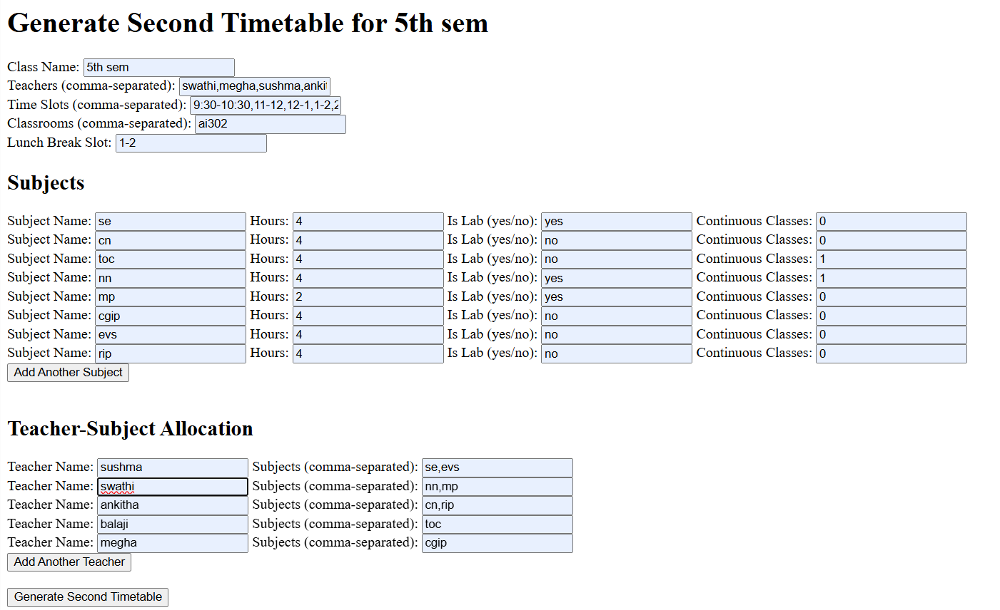
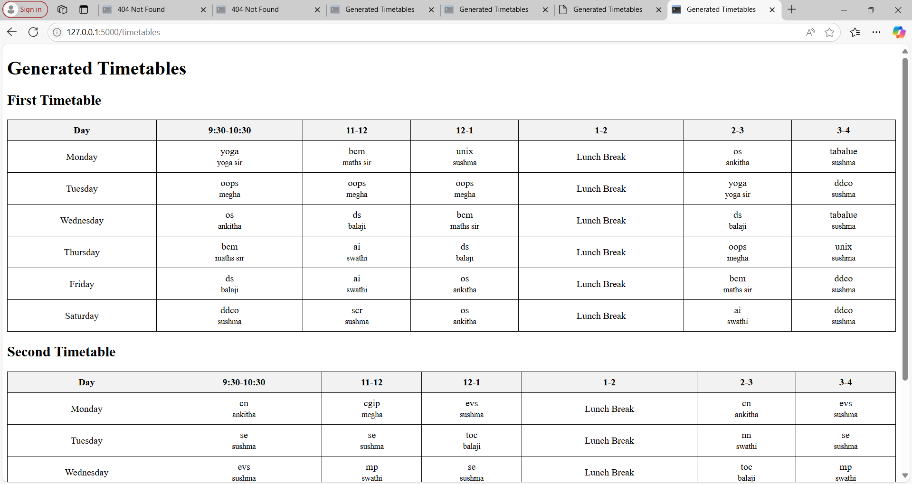
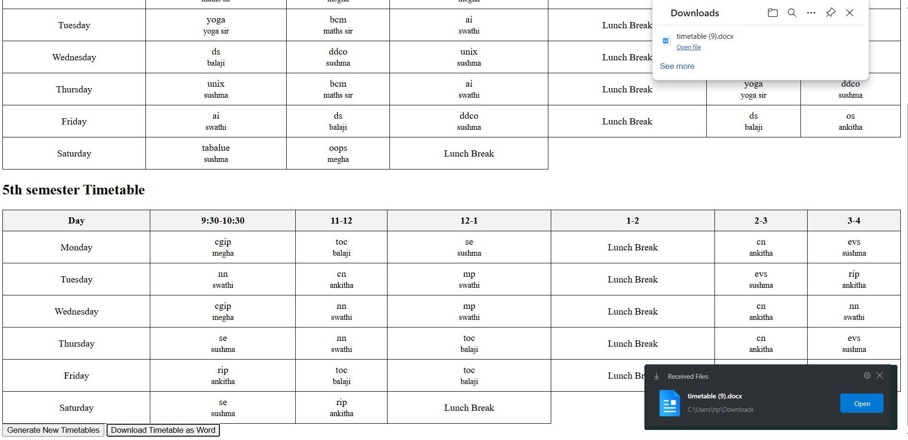

# AI-Powered Timetable Generator

## Overview

AI-Powered Timetable Generator is a web-based application that automatically generates optimized academic timetables using a Genetic Algorithm. The system creates timetables for multiple classes while avoiding teacher scheduling conflicts and supporting continuous class allocation.

## Features

* Automatic Timetable Generation
* Genetic Algorithm-Based Optimization
* Multi-Class Timetable Generation
* Teacher Conflict Prevention
* Continuous Class Scheduling
* Classroom Allocation
* Lunch Break Scheduling
* Download Timetable as Word Document

## Technologies Used

* Python
* Flask
* HTML
* CSS
* Genetic Algorithm
* Python-docx

## Project Interface

### Input Page



### Generated Timetable



### Timetable Download



## Installation

```bash
pip install -r requirements.txt
```

## Contributors

* Samyuktha HS
